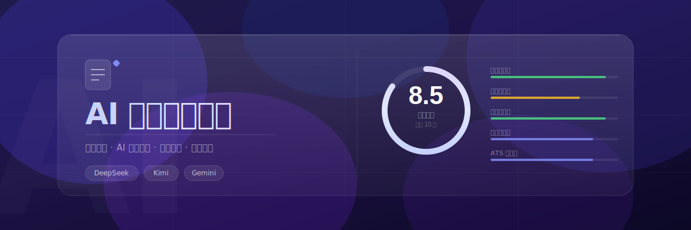

# AI 简历优化助手

上传简历文件，获取 AI 驱动的专业优化建议。


## 功能

- 支持上传 PDF / DOCX / Markdown / TXT 格式简历
- 前端解析文件内容，流式调用 AI 接口进行深度分析
- 多模型支持：DeepSeek / Kimi / Gemini 三种 AI 服务，顶栏一键切换，各模型 API Key 独立存储于本地
- 用户画像选择：工作年限、目标行业、岗位细分（互联网/科技行业支持产品经理、Java开发、iOS开发等岗位，含深度评估维度、量化指标引导与 ATS 关键词）
- JD 匹配优化：粘贴目标职位描述，AI 额外输出匹配度评分和定向建议
- 简历评分可视化：分析完成后自动展示综合评分及内容完整度、成果量化度、结构清晰度、表达专业度、ATS友好度五维评分进度条，配色随分值高低变化
- 分析过程可随时取消，支持流式进度显示
- 优化后的简历可直接在页面内编辑修改，并支持单独复制
- 可视化简历生成：分析完成后一键将优化后的简历渲染为精美 A4 模板（Classic 风格），支持头像上传、字段可编辑，可直接导出 PDF
- 结果支持一键复制、导出为 Markdown 文件
- CDN 依赖加载失败自动检测提示

## 技术栈

- 纯 HTML + CSS + JavaScript，无框架无构建工具
- 纯前端架构，无需后端服务器
- CDN 依赖：pdf.js、mammoth.js、marked.js

## 使用流程

**配置** → 顶栏选择模型（DeepSeek / Kimi / Gemini），输入对应 API Key

**上传** → 拖拽或点击上传简历文件（PDF / DOCX / MD / TXT），前端解析

**背景** → 选择工作年限、目标行业、目标岗位，动态组装分析 Prompt

**JD 匹配**（可选）→ 粘贴职位描述，AI 额外输出匹配度分析

**AI 分析** → 点击「开始优化」，流式实时渲染结果，可随时取消

**查看结果** → 右栏依次展示：评分卡（6 维）、优化建议（只读）、优化后的简历（可编辑）

**导出** → 复制 / 导出 Markdown，或点击「生成可视化简历」→ 在弹窗中确认字段 → 新窗口预览 A4 模板 → 导出 PDF

## 文件结构

```
index.html          - 页面结构 + CDN 引入
style.css           - 全部样式（仅桌面端）
prompts.js          - 所有 Prompt 模板（BASE_PROMPT、四个维度对象、buildSystemPrompt）
app.js              - 全部业务逻辑（文件解析、API 调用、流式渲染、结果拆分、导出）
resume-form.js      - 可视化简历表单（Markdown 自动解析 + 弹窗交互逻辑）
templates/
  classic.js        - Classic 简历 HTML 模板生成器（generateClassicHTML）
```

## 更新日志

- **v1.0** — MVP 核心功能上线（上传 → 解析 → AI分析 → 展示）
- **v1.1** — 用户画像选择（工作年限 + 行业 + 互联网岗位细分）
- **v1.2** — JD 匹配优化（粘贴 JD，AI 输出匹配度分析）；导出为 Markdown 文件
- **v1.3** — UI/UX 升级（CSS 变量体系、渐变、动效、无障碍）
- **v1.4** — Prompt 深度优化（互联网行业框架 + 产品经理/Java开发/iOS开发岗位评估维度、量化指标、ATS 关键词）
- **v1.5** — 可靠性与体验提升（max_tokens 8192、取消分析按钮、流式进度提示、CDN 加载检测）
- **v1.6** — 端到端测试验证通过（真实 API Key + 简历文件全流程测试）
- **v1.7** — UI 全局重设计（双栏工具式布局：左侧配置栏 + 右侧结果栏；API Key 移至顶栏；步骤编号引导；结果区白色卡片；纯 CSS 空态控制）
- **v1.8** — 简历评分可视化（综合评分大数字 + 5 维度进度条；配色随分值变化：≥8 绿、≥6 琥珀、<6 红；流式接收完成后自动渲染，进度条带缓入动画）
- **v1.9** — 多模型支持（DeepSeek / Kimi / Gemini；PROVIDERS 配置对象解耦 endpoint/格式/delta 提取；各模型 API Key 独立 localStorage；顶栏 pill 切换器，刷新后恢复上次选择）
- **v2.0** — Prompt 模板提取为独立文件（`prompts.js`）；优化后的简历流式结束后独立渲染为可编辑文本区，支持直接修改和单独复制
- **v2.1** — 可视化简历生成（Markdown → 结构化表单解析；Classic A4 模板；头像上传；字段可编辑；一键导出 PDF）；修复 `splitResultSections` 正则在简历内含 `##` 标题时截断的问题；简历章节识别兼容 `##` / `###` / `**粗体行**` 三种 AI 输出格式；修复电话号码误捕获日期的问题

## 需要

- DeepSeek API Key（从 https://platform.deepseek.com 获取）
- 现代浏览器（Chrome / Edge / Firefox / Safari）
